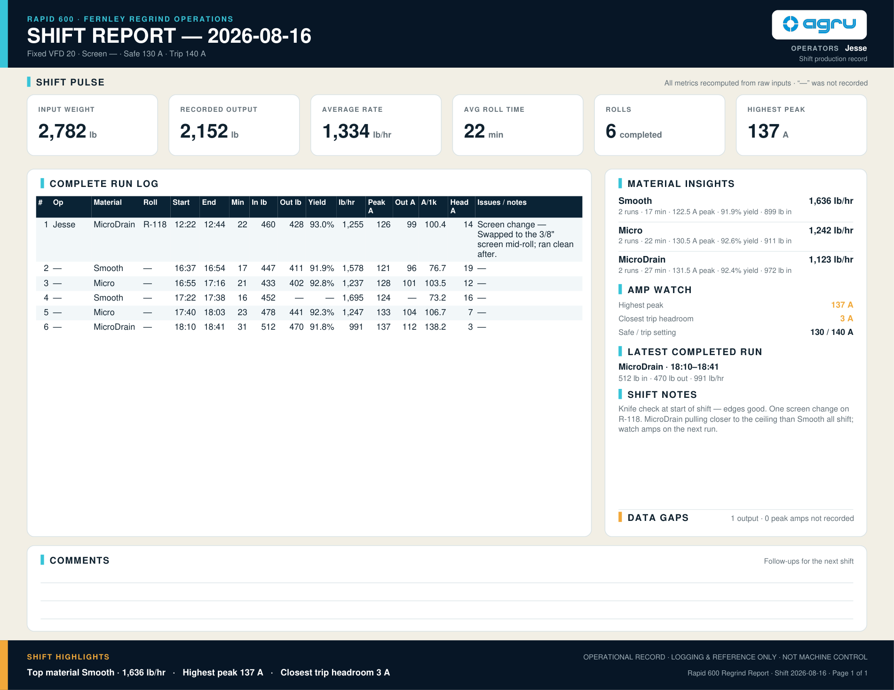
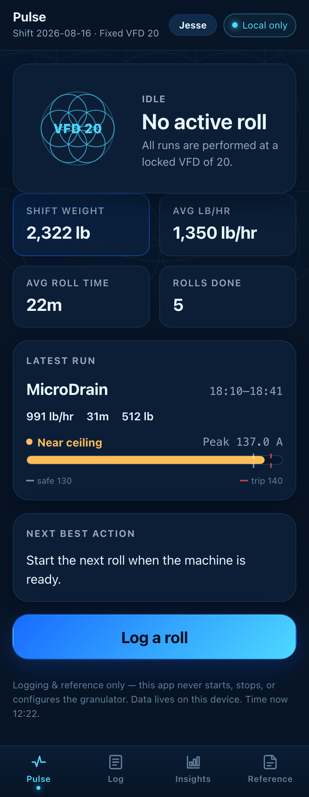

# Rapid 600 Regrind Report

[](https://github.com/JesseDiaz47/rapid-600-regrind-report/actions/workflows/ci.yml)
[](./LICENSE)
[](https://www.typescriptlang.org/)
[](https://react.dev/)
[](https://vite.dev/)
[](#commands)
[](#privacy--non-goals)
[](https://github.com/JesseDiaz47/rapid-600-regrind-report/commits/main)

A **local-only** production tracker for regrind runs on the Rapid Granulator
600-150 at AGRU Fernley, performed at a **fixed VFD of 20**. It answers the
questions a shift actually cares about: who ran it, what material, how much it
weighed, how long it took, what throughput it hit, and what happened during the run.

Built for the shared station computer or tablet at the machine, and it collapses
to a one-handed phone layout on anything narrower.

This is a **logging and reference tool**, not machine control. It never starts,
stops, or configures the granulator, and it is not a VFD optimizer — VFD 20 is
shown as locked context, never an editable or "recommended" setting.

## Demo


Sign in → start a roll → live timer → finish roll → totals and Insights update.
Recorded against the running app with clearly-labeled demo data — no real
production records. Sharper copy to download: [demo.mp4](docs/screenshots/demo.mp4).

## Screenshots

### Pulse — the glance screen

Shift totals, the last run's amp headroom, and one plain-English next action.


### Log — start a roll, finish a roll

One number required to start: input weight. The timer runs, and the finish
fields are already on screen waiting.


### Insights — material vs material

Per-material throughput, weight, roll time and peak amps, plus a head-to-head
comparison. It compares materials, never VFDs — every run is at 20.


### Reference — thresholds, formulas, and your data


More: [sign-in](docs/screenshots/00-sign-in.png) ·
[start a roll](docs/screenshots/02-log-start.png) ·
[shift list after logging](docs/screenshots/04-log-list.png)

#### The shift report it exports

Reference → **Export PDF report** turns the shift into a single landscape page
built for handing over: Shift Pulse totals across the top, the complete run log
with every raw value and its derived metrics, material insights and amp watch
down the side, shift notes, and a comments band left blank for the next shift
to write on.

[**Download the sample PDF →**](docs/examples/shift-report-sample.pdf)



Worth noting in the page above:

- **Every raw value and every derived one sit side by side** — in/out weight,
  start and end, peak and running-out amps next to lb/hr, yield, A per 1k and
  headroom — so a number can be checked by hand against the sheet it came from.
- **`—` means not recorded**, never zero. The **Data gaps** line counts them
  outright (`1 output · 0 peak amps not recorded`) rather than letting a blank
  pass unnoticed.
- **Operator attribution per run**, from the name signed in when it was logged.
- **The footer says what the document is**: *operational record · logging &
  reference only · not machine control*.

> The sample above is generated from the app's built-in **demo data** plus one
> logged run — it is not a real production record. Note that demo runs carry a
> DEMO badge in the app but **that badge does not currently appear in the PDF or
> CSV export**, so a report exported with demo data loaded looks like a real one.
> Clear demo runs before exporting anything that leaves the device.

### Same app on a phone

The layout collapses to a bottom tab bar under 900px, so the station tablet and
a phone in a pocket run the identical build.



## Documentation

| Guide | For |
|---|---|
| **[Operator Guide](docs/OPERATOR-GUIDE.md)** | Using it at the machine. Plain English, printable, no setup — sign in, log a roll, read the amp bar, export at end of shift. |
| **[Walkthrough](docs/WALKTHROUGH.md)** | How it's built and why — screen by screen, the calculations, the local-only trade-offs, and the known limits. |

## Features

- **Sign-in** — pick your name from the employee roster (managed in Reference →
  Employees) before logging anything. Local attribution for accountability, not
  an account system — an optional PIN just guards against tapping the wrong name
  on a shared device.
- **Pulse** — active-run timer, fixed VFD 20 context, shift totals (weight, avg
  lb/hr, avg roll time, rolls done), latest run with amp headroom, and
  missing-data prompts.
- **Log** — one-handed **Start Roll → live timer → Finish Roll** workflow, plus
  manual completed-run entry/edit, duplicate-last-run, and confirmed
  delete with undo.
- **Insights** — per-material count, total weight, avg roll time, avg lb/hr and
  avg peak amps; material-vs-material comparison; dependency-free throughput and
  amp trend bars. Compares materials, never VFDs.
- **Reference** — plain-English formulas, editable safe/trip amp thresholds and
  screen size, per-material notes, CSV export, versioned JSON backup/restore,
  New Shift / Clear All with confirmation, print, Quiet Mode, and clearly-labeled
  demo data.

## Calculations

All metrics are recomputed from raw entered values — never trusted from stale
saved output — and **missing optional values stay missing** (they render as `—`,
never invented zeros):

- Duration = end − start, adding 24h across a midnight crossover
- lb/hr = input weight ÷ (duration ÷ 60)
- Yield % = output ÷ input × 100 (blank without an output weight)
- A per 1k lb/hr = peak amps ÷ lb/hr × 1000
- Headroom = trip threshold − peak amps, with safe/near/trip status

## Getting started

Needs **Node.js 20.19 or newer** (22 LTS recommended) and npm — Vite 8 and
TypeScript 6 require it, and `npm install` stops with a clear message on
anything older. Nothing else: no database, no API keys, no `.env`.

```bash
git clone https://github.com/JesseDiaz47/rapid-600-regrind-report.git
cd rapid-600-regrind-report
npm install
npm run dev        # Vite dev server at http://localhost:4175
```

Open the dev server URL, then:

1. **Sign in.** First launch has no roster — type a name and tap **Add
   employee** to create it, then tap your name on the picker. More names get
   added later from Reference → Employees.
2. **Try it with sample data.** Reference → Demo data → **Load demo runs**
   seeds a few clearly-labeled runs (each tagged `demo: true`) so Pulse,
   Log, and Insights aren't empty while you look around. Clear them from the
   same panel whenever you're done.
3. **Log a run.** Log → fill in material and input weight → **Start Roll**
   starts the live timer; **Finish Roll** records end time, output weight,
   peak/running-out amps, and any issue flags.
4. **Check the numbers.** Pulse shows shift totals and amp headroom on the
   latest run; Insights compares materials against each other for this
   shift.

Everything is written to the browser's `localStorage` — nothing leaves the
device (see [Privacy & non-goals](#privacy--non-goals)).

For the shop-floor version of these steps — no clone, no terminal — see the
**[Operator Guide](docs/OPERATOR-GUIDE.md)**.

### Commands

```bash
npm install       # install dependencies
npm run dev       # start the dev server (Vite)
npm test          # run the Vitest suite
npm run lint      # oxlint
npm run typecheck # tsc project build (no emit)
npm run build     # typecheck + production build to dist/
npm run preview   # serve the production build locally
npm run check     # typecheck + lint + test + build, the gate CI runs
npm run audit     # npm audit
```

## Privacy & non-goals

- **Local only.** All shift data lives in your browser's `localStorage`. There
  is no backend, cloud database, cloud account, password-based auth, telemetry,
  or company integration. The employee roster and sign-in are a local, on-device
  name picker for attribution — not a cloud account system. Clearing browser data
  erases everything — **export a JSON backup regularly** (Reference → Export
  JSON backup). A backup carries the employee roster alongside the shift data,
  **including each employee's PIN in plain text**, so treat the file as readable
  by anyone who can reach the folder you save it into.
- **Not machine control.** No machine control, no automatic VFD changes, no real
  production records committed to the repo.
- **Offline.** Ships a web manifest and a cache-first service worker, so once
  loaded it works offline and can be added to a phone home screen. Each build
  stamps its own id into the worker, so deploying a new version retires the old
  cache automatically — no constant to bump by hand. An installed device picks
  the release up on its **next** launch: the launch after a deploy still serves
  the cached copy while the new worker installs in the background. Reference
  shows the running build at the bottom, which is how you tell whether a given
  phone or tablet has the update.

Backups are versioned; restore validates the app signature, schema version, and
every numeric range before trusting a file. Shift data is replaced wholesale on
restore, but the roster is **merged**: employees this device doesn't have are
added, and anyone already on it is left exactly as they are, so restoring an
older backup onto a shared tablet never resurrects someone who was removed after
that backup was taken. Backups written before the roster was included restore
exactly as they always did.

If saved data can't be read at all — corrupt, or written by a newer version —
the app doesn't start empty and overwrite it. The original is set aside and
Reference offers it back as a download.

## License

[MIT](./LICENSE) © 2026 Jesse Diaz.

The license covers the code in this repository. It carries no production data:
every number in the screenshots, the sample report, and the test suite comes
from the built-in demo set or from fixtures.
