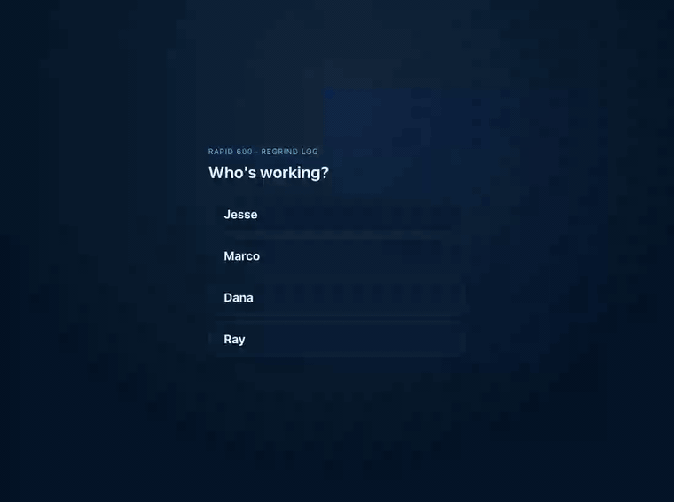

# Rapid 600 Regrind Report

A phone-first, **local-only** production tracker for regrind runs on the Rapid
Granulator 600-150 at AGRU Fernley, performed at a **fixed VFD of 20**. It answers
the questions a shift actually cares about: who ran it, what material, how much it
weighed, how long it took, what throughput it hit, and what happened during the run.

This is a **logging and reference tool**, not machine control. It never starts,
stops, or configures the granulator, and it is not a VFD optimizer — VFD 20 is
shown as locked context, never an editable or "recommended" setting.

## Demo

<p align="center">
  
</p>

<p align="center"><sub>Sign in → start a roll → live timer → finish roll → Insights.
Full-resolution version: <a href="docs/screenshots/demo.mp4">docs/screenshots/demo.mp4</a>.
Shown with clearly-labeled demo data, not real production runs.</sub></p>

## Screenshots

<table>
  <tr>
    <td align="center" width="20%">
      <br>
      <sub><b>Pulse</b><br>shift totals & headroom</sub>
    </td>
    <td align="center" width="20%">
      <br>
      <sub><b>Log</b><br>live run → Finish Roll</sub>
    </td>
    <td align="center" width="20%">
      <br>
      <sub><b>Insights</b><br>per-material breakdown</sub>
    </td>
    <td align="center" width="20%">
      <br>
      <sub><b>Reference</b><br>thresholds & roster</sub>
    </td>
    <td align="center" width="20%">
      <br>
      <sub><b>Sign-in</b><br>local roster picker</sub>
    </td>
  </tr>
</table>

## Features

- **Sign-in** — pick your name from the employee roster (managed in Reference →
  Employees) before logging anything. Local attribution for accountability, not
  an account system — an optional PIN just guards against tapping the wrong name
  on a shared device.
- **Pulse** — active-run timer, fixed VFD 20 context, shift totals (weight, avg
  lb/hr, avg roll time, rolls done), latest run with amp headroom, and
  missing-data prompts.
- **Log** — one-handed **Start Roll → live timer → Finish Roll** workflow, plus
  manual completed-run entry/edit, duplicate-last-run, and confirmed
  delete with undo.
- **Insights** — per-material count, total weight, avg roll time, avg lb/hr and
  avg peak amps; material-vs-material comparison; dependency-free throughput and
  amp trend bars. Compares materials, never VFDs.
- **Reference** — plain-English formulas, editable safe/trip amp thresholds and
  screen size, per-material notes, CSV export, versioned JSON backup/restore,
  New Shift / Clear All with confirmation, print, Quiet Mode, and clearly-labeled
  demo data.

## Calculations

All metrics are recomputed from raw entered values — never trusted from stale
saved output — and **missing optional values stay missing** (they render as `—`,
never invented zeros):

- Duration = end − start, adding 24h across a midnight crossover
- lb/hr = input weight ÷ (duration ÷ 60)
- Yield % = output ÷ input × 100 (blank without an output weight)
- A per 1k lb/hr = peak amps ÷ lb/hr × 1000
- Headroom = trip threshold − peak amps, with safe/near/trip status

## Getting started

```bash
git clone https://github.com/JesseDiaz47/rapid-600-regrind-report.git
cd rapid-600-regrind-report
npm install
npm run dev        # Vite dev server at http://localhost:4175
```

Open the dev server URL, then:

1. **Sign in.** First launch has no roster — type a name and tap **Add
   employee** to create it, then tap your name on the picker. More names get
   added later from Reference → Employees.
2. **Try it with sample data.** Reference → Demo data → **Load demo runs**
   seeds a few clearly-labeled runs (each tagged `demo: true`) so Pulse,
   Log, and Insights aren't empty while you look around. Clear them from the
   same panel whenever you're done.
3. **Log a run.** Log → fill in material and input weight → **Start Roll**
   starts the live timer; **Finish Roll** records end time, output weight,
   peak/running-out amps, and any issue flags.
4. **Check the numbers.** Pulse shows shift totals and amp headroom on the
   latest run; Insights compares materials against each other for this
   shift.

Everything is written to the browser's `localStorage` — nothing leaves the
device (see [Privacy & non-goals](#privacy--non-goals)).

### Commands

```bash
npm install       # install dependencies
npm run dev       # start the dev server (Vite)
npm test          # run the Vitest suite
npm run lint      # oxlint
npm run typecheck # tsc project build (no emit)
npm run build     # typecheck + production build to dist/
npm run preview   # serve the production build locally
```

## Privacy & non-goals

- **Local only.** All shift data lives in your browser's `localStorage`. There
  is no backend, cloud database, cloud account, password-based auth, telemetry,
  or company integration. The employee roster and sign-in are a local, on-device
  name picker for attribution — not a cloud account system. Clearing browser data
  erases everything — **export a JSON backup regularly** (Reference → Export
  JSON backup). A backup carries the employee roster alongside the shift data,
  **including each employee's PIN in plain text**, so treat the file as readable
  by anyone who can reach the folder you save it into.
- **Not machine control.** No machine control, no automatic VFD changes, no real
  production records committed to the repo.
- **Offline.** Ships a web manifest and a cache-first service worker, so once
  loaded it works offline and can be added to a phone home screen. Each build
  stamps its own id into the worker, so deploying a new version retires the old
  cache automatically — no constant to bump by hand. An installed device picks
  the release up on its **next** launch: the launch after a deploy still serves
  the cached copy while the new worker installs in the background. Reference
  shows the running build at the bottom, which is how you tell whether a given
  phone or tablet has the update.

Backups are versioned; restore validates the app signature, schema version, and
every numeric range before trusting a file. Shift data is replaced wholesale on
restore, but the roster is **merged**: employees this device doesn't have are
added, and anyone already on it is left exactly as they are, so restoring an
older backup onto a shared tablet never resurrects someone who was removed after
that backup was taken. Backups written before the roster was included restore
exactly as they always did.

If saved data can't be read at all — corrupt, or written by a newer version —
the app doesn't start empty and overwrite it. The original is set aside and
Reference offers it back as a download.
