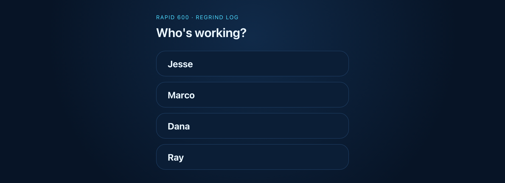
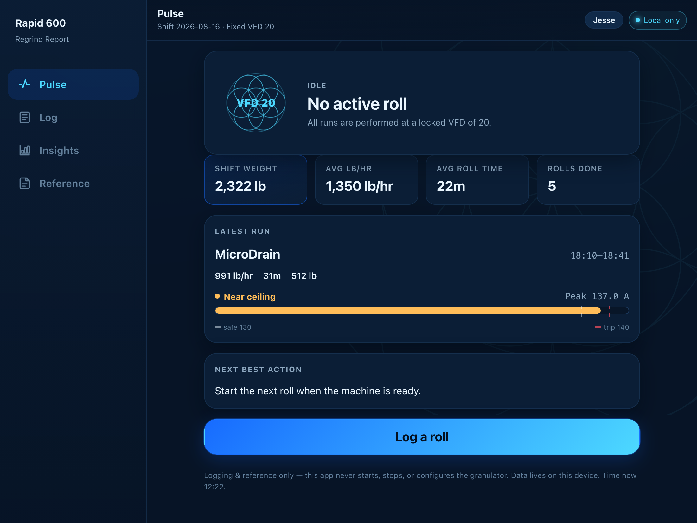
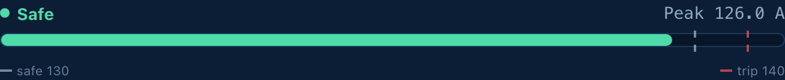
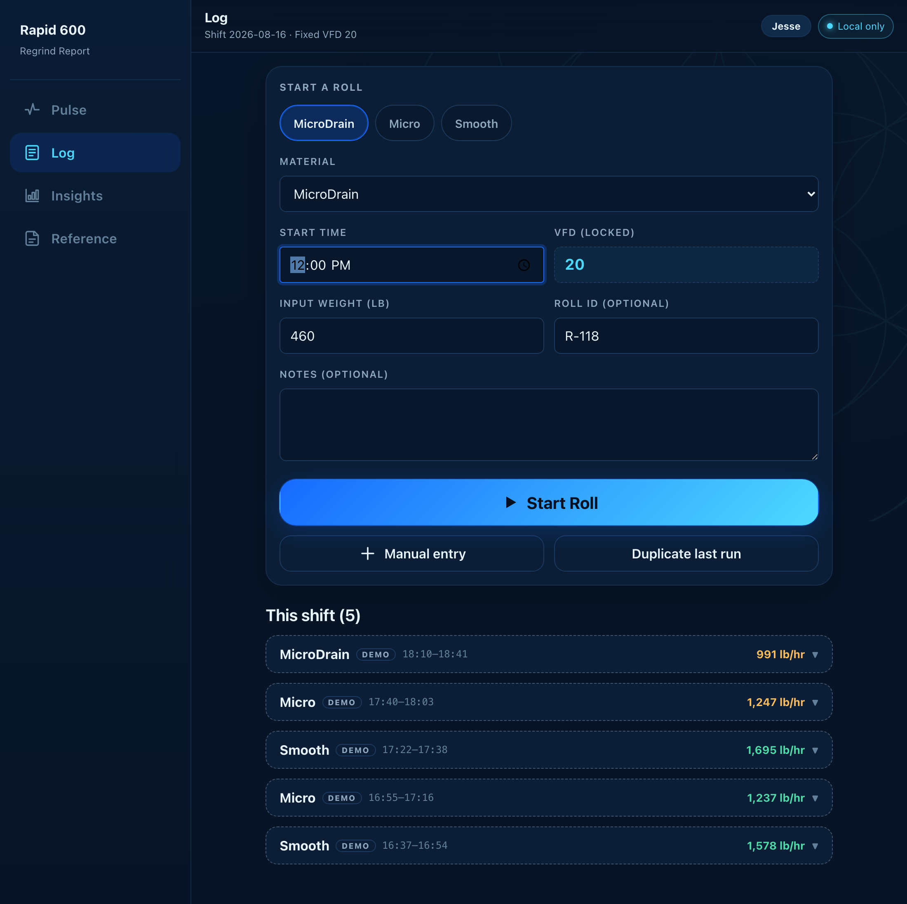
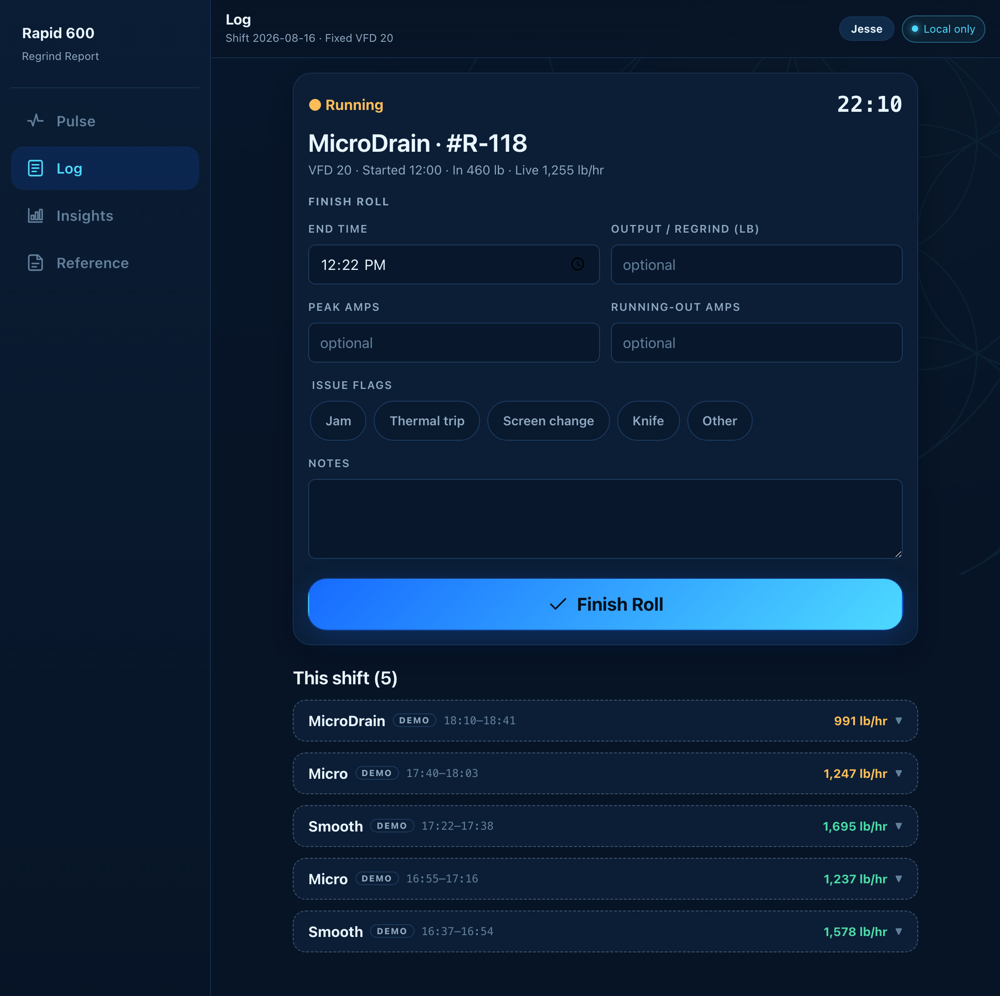
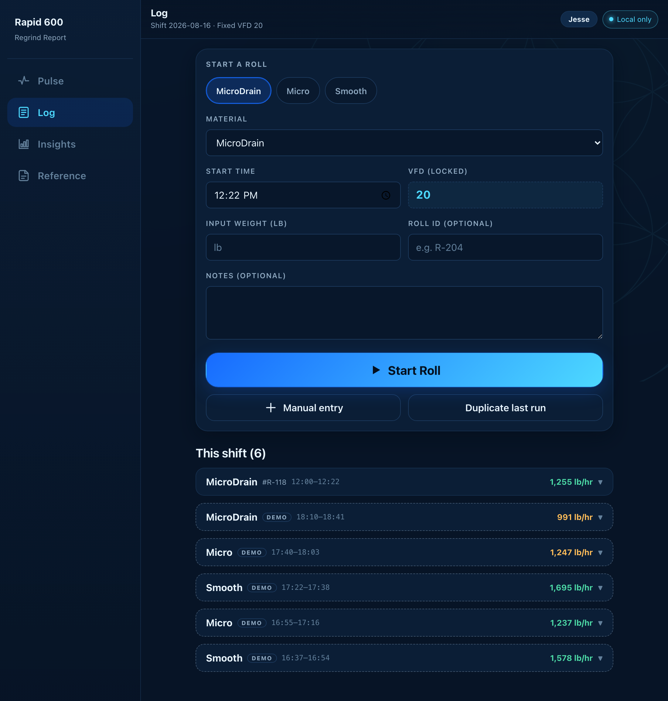
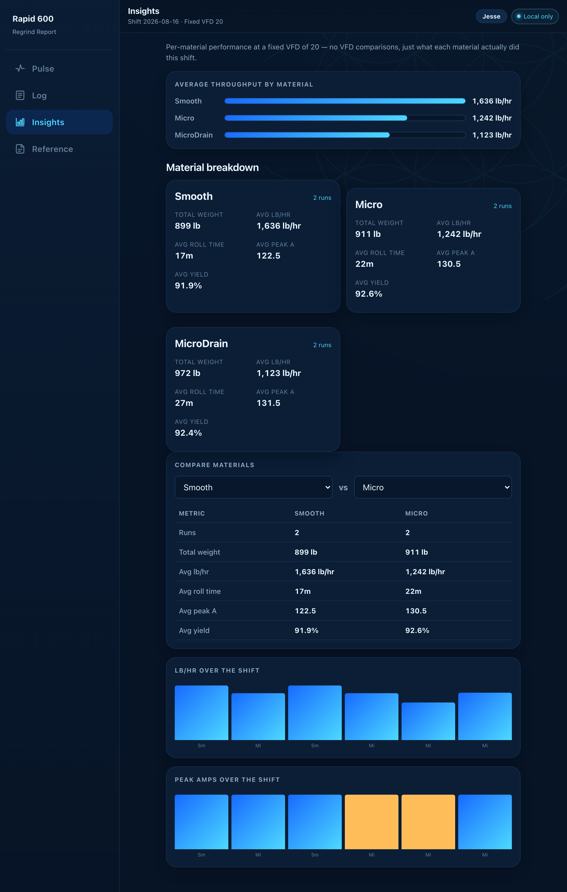
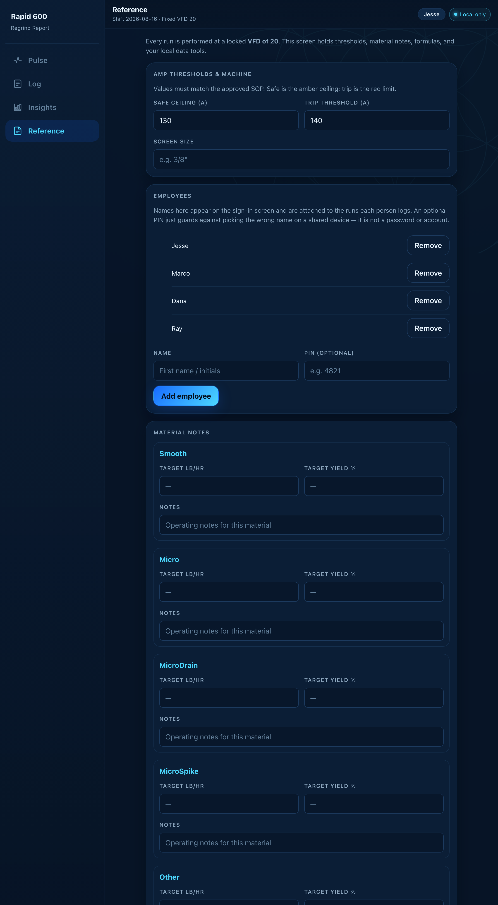

# Walkthrough

A screen-by-screen tour of the Rapid 600 Regrind Report, and the reasoning
behind how each one is built. If you just want to *use* the app, read the
[Operator Guide](OPERATOR-GUIDE.md) instead.

## The constraints that shaped it

Every decision below follows from where this runs:

- **A shared tablet bolted near a granulator**, not a personal phone. One
  device, several operators per day.
- **Gloved hands, one free.** Targets are large; the primary action on each
  screen is a full-width button pinned within thumb reach.
- **No reliable network on the floor.** The app has to work with the plant
  Wi-Fi down, which rules out a server round-trip in the logging path.
- **The data is production truth.** A wrong number is worse than a missing
  one, so the app never fills a gap with a guess.
- **It must not look like machine control.** An operator glancing at it should
  never think the app changes how the granulator runs.

**One layout, two shapes.** At 900px and up the navigation is a left rail and
the metric tiles sit in a single row — that's the station computer or tablet,
and it's what the screenshots below show. Below 900px the same build collapses
to a bottom tab bar and a single column for a phone. There is no separate
mobile version and no second codebase.

---

## Sign-in



**This is attribution, not authentication.** There is no backend to
authenticate against. It answers "whose name goes on this run?" — nothing more.

- Names come from a local roster managed in Reference → Employees.
- An optional PIN guards against tapping the wrong name on a shared device. It
  is not a password; the backup file stores it in plain text and
  [the README says so outright](../README.md#privacy--non-goals).
- A **Can't sign in?** escape hatch clears every PIN on the device. Without it,
  a forgotten PIN would cover the whole app with no way past — on a tablet at
  the machine that means the shift simply cannot be logged. Names and runs
  survive; only the PIN guard is removed.

The operator's name is **copied onto each run at logging time**
(`Run.operatorName`) rather than referenced by id, so removing someone from the
roster later doesn't rewrite history in past shift reports.

---

## Pulse — the glance screen



Answers "how is the shift going?" without any interaction.

- **Shift totals** — weight, average lb/hr, average roll time, rolls done.
- **Latest run** with its amp headroom bar.
- **Next best action** — one plain-English line, so the screen ends in a
  suggestion rather than a wall of figures.
- **VFD 20 shown as locked context.** It appears as a static value, never a
  form control. The app is not a VFD optimizer and deliberately offers no
  "recommended" setting.

### The headroom bar



Peak amps against the safe ceiling and trip threshold, with `safe` / `trip`
marks on the track and a legend beneath.

Status is carried by **an explicit text label as well as colour** (`Safe`,
`Near ceiling`, `At / over trip`), so it never depends on colour perception
alone.

> The legend sits in a fixed row rather than hanging off each mark. Labels used
> to be absolutely positioned under the marks they described, which broke at
> the default thresholds: 130 A and 140 A are only a few percent apart on a
> phone-width track, so the two labels rendered on top of each other as
> unreadable overlapping text. A legend cannot collide at any threshold values,
> and cannot overflow the end of the track the way a centred label near 100%
> did. [`HeadroomBar.test.tsx`](../src/components/ui/HeadroomBar.test.tsx)
> guards the structure, since jsdom does no layout and cannot measure the
> overlap itself.

---

## Log — the actual job

Two taps at opposite ends of a run, with a live timer between them.



*Starting* — recent materials as one-tap chips, VFD shown locked at 20.



*Running* — live timer, with the finish fields already on screen.

**Start Roll** needs one number: input weight. Everything else is optional or
prefilled. The start time defaults to now and stays editable, because a roll is
often logged a few minutes after it actually started — and since duration and
lb/hr derive from that timestamp, letting it be corrected is what keeps the
whole run's math honest.

**Finish Roll** collects end time, output weight, peak and running-out amps,
issue flags (Jam · Thermal trip · Screen change · Knife · Other) and notes.
Every one of those is optional.

Also here: **manual entry** for a run that already finished, **duplicate last
run** for a repeat, and delete with **undo**.



Completed runs stack under **This shift**. Sample rows carry a **DEMO** badge
and a `demo: true` flag so they can be cleared in one action and can never be
mistaken for production records — the run at the top of that list is the real
one just logged, and it is the only row without the badge.

---

## Insights — material vs material



Per-material count, total weight, average roll time, average lb/hr and average
peak amps, plus dependency-free trend bars (plain CSS, no chart library).

**It compares materials, never VFDs.** Every run happens at VFD 20, so a
VFD comparison would be meaningless here — and inviting one would turn a
logbook into something that looks like a tuning tool.

---

## Reference — settings, formulas, and the data escape hatches



- **Amp thresholds & machine** — safe ceiling, trip threshold, screen size.
  Editable because they must track the approved SOP.
- **Employees** — the roster behind sign-in.
- **Formulas** — every calculation written out in plain English, so a number on
  screen can always be traced back by hand.
- **Material notes**, **shift notes**.
- **Data (local only)** — CSV, JSON backup, JSON restore, PDF report. Where the
  browser supports it, a chosen **reports folder** takes exports directly with
  no save dialog each time.
- **New shift** / **Clear all data**, both behind a confirm step.
- **Quiet Mode** — stops the breathing geometry and glow.
- **Build id** at the bottom, which is how you tell whether a given tablet has
  picked up a release.

Printing uses the browser's own print command while on this screen; a hidden
`PrintSheet` renders a landscape report under `@media print`.

---

## How the numbers work

Metrics are **recomputed from raw entered values on every render** and never
persisted as authoritative, so a stale saved figure can't outlive the values it
came from.

| Metric | Formula |
|---|---|
| Duration | end − start, adding 24 h across a midnight crossover |
| lb/hr | input weight ÷ (duration ÷ 60) |
| Yield % | output ÷ input × 100 — blank without an output weight |
| A per 1k lb/hr | peak amps ÷ lb/hr × 1000 |
| Headroom | trip threshold − peak amps, with safe / near / trip status |

**Missing optional values stay missing.** They are `null` in the domain layer
and render as `—`. Nothing defaults to zero, and no run is ever credited with
100% yield because the output was never weighed.

---

## Architecture

```
src/
  types/domain.ts   the data model, FIXED_VFD, SCHEMA_VERSION, enums
  lib/              pure, tested logic — no React
  hooks/            useAppState, useRoster, useNow, usePreferences
  components/       presentation only
  styles/           token-driven dark theme
```

The split is deliberate: everything that can be wrong about a *number* lives in
`src/lib` as pure functions with unit tests, and everything in `components/`
just renders what it's handed.

**Local only.** All state is in `localStorage`. No backend, no telemetry, no
network calls beyond a service worker caching same-origin assets. That is a
real trade — clearing browser data destroys unexported work, which is why the
app pushes backups so hard — but it's what lets the logging path work with the
plant network down.

**Storage is defensive.** Restores validate app signature, schema version and
every numeric range before being trusted. Shift data is replaced wholesale, but
the roster is *merged*, so restoring an older backup onto a shared tablet never
resurrects an employee who was removed after it was taken. If saved data can't
be read at all, the app **does not** start empty over the top of it — the
original is quarantined and offered back as a download.

**Offline updates.** Each build stamps its own id into the service worker, so a
release retires the previous cache automatically instead of relying on someone
remembering to bump a constant. An installed device picks a release up on its
*next* launch.

---

## Testing

Vitest + Testing Library in jsdom; `src/test/setup.ts` clears `localStorage`
and stubs `matchMedia` per test.

Domain modules in `src/lib` are unit-tested — midnight-crossing durations,
missing-value handling, CSV escaping, backup validation and range checks.
`src/App.test.tsx` covers start/finish, manual entry, delete and undo
end-to-end.

```bash
npm test          # once
npm run lint      # oxlint
npm run typecheck # tsc -b
npm run build     # typecheck + production build
```

---

## Known limits

- **One device is the system of record.** No sync between tablets; a backup
  file is the only way to move a shift.
- **PINs are stored in plain text** in backups. They are a mis-tap guard, and
  the docs say so rather than implying security that isn't there.
- **No authentication of any kind.** Anyone holding the tablet can log as
  anyone on the roster.
- **The main JS bundle is over 500 kB** before gzip, mostly the PDF pipeline.
  It's cached after first load, so it costs the first visit rather than the
  shift.
